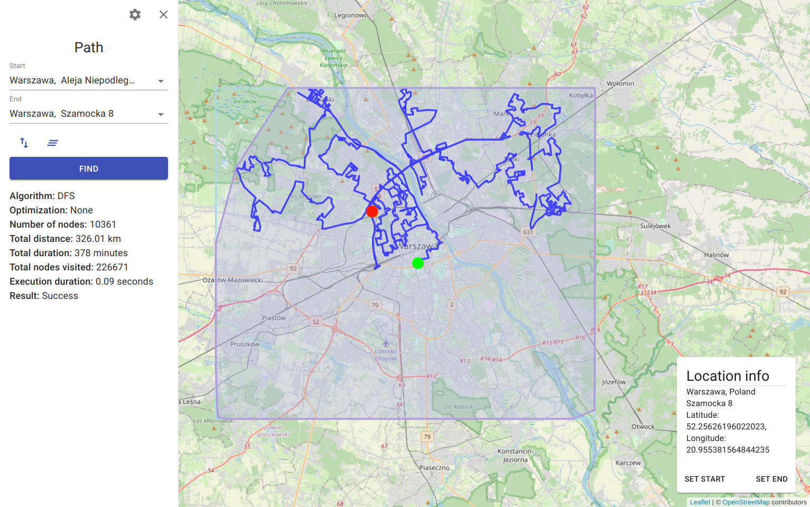
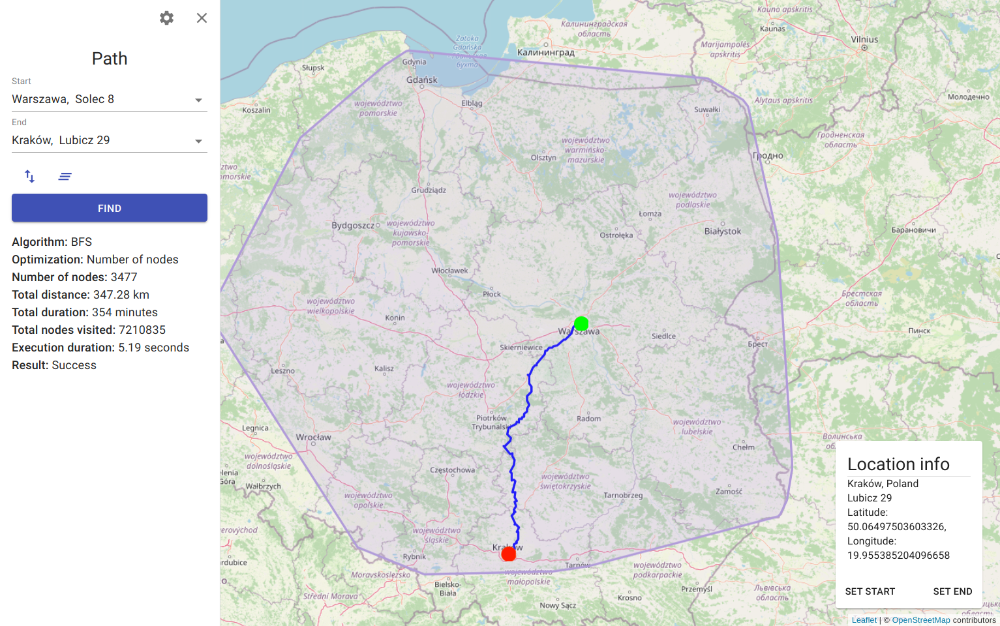
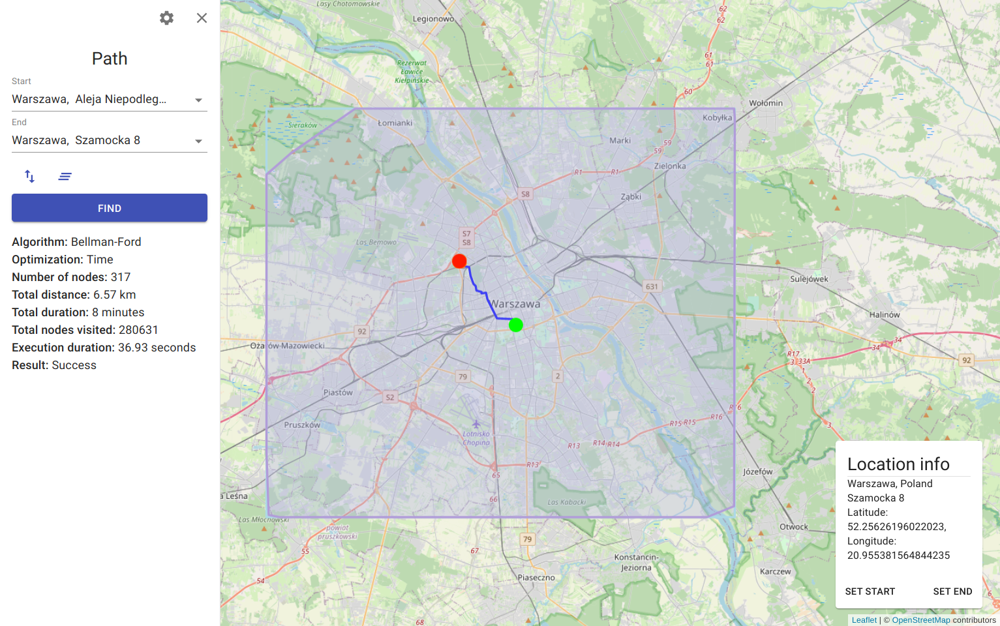
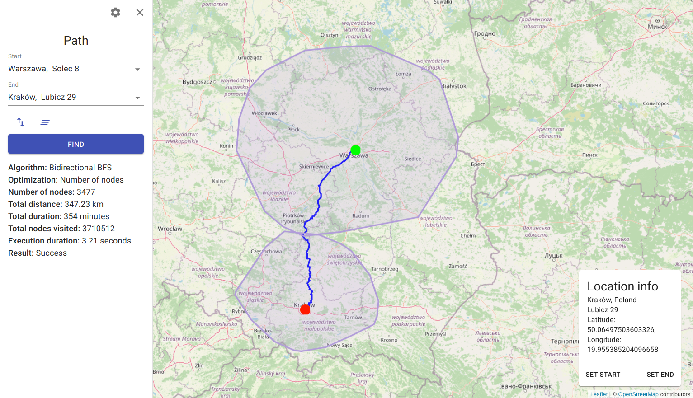
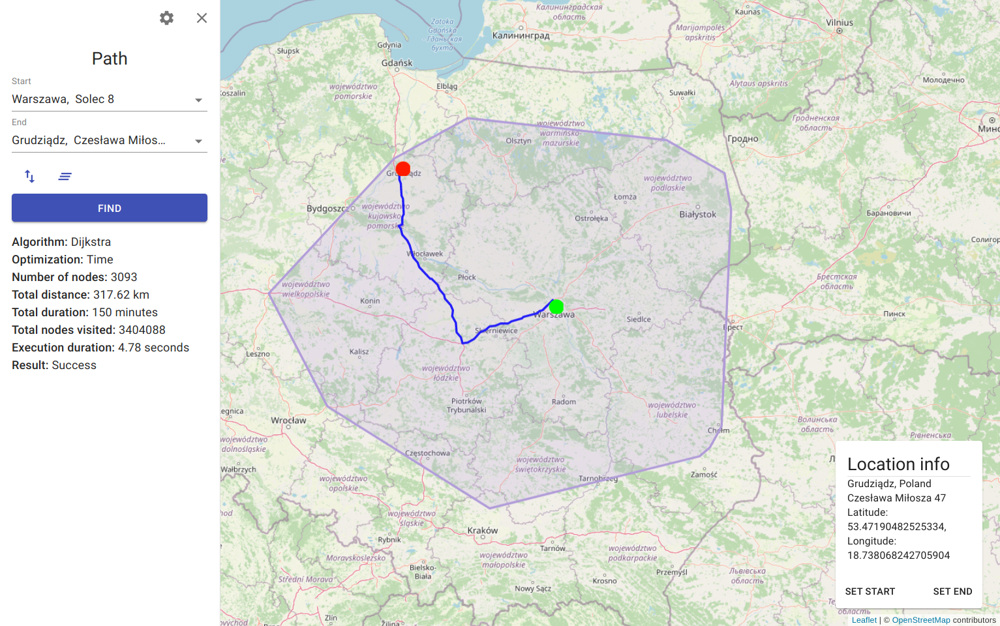
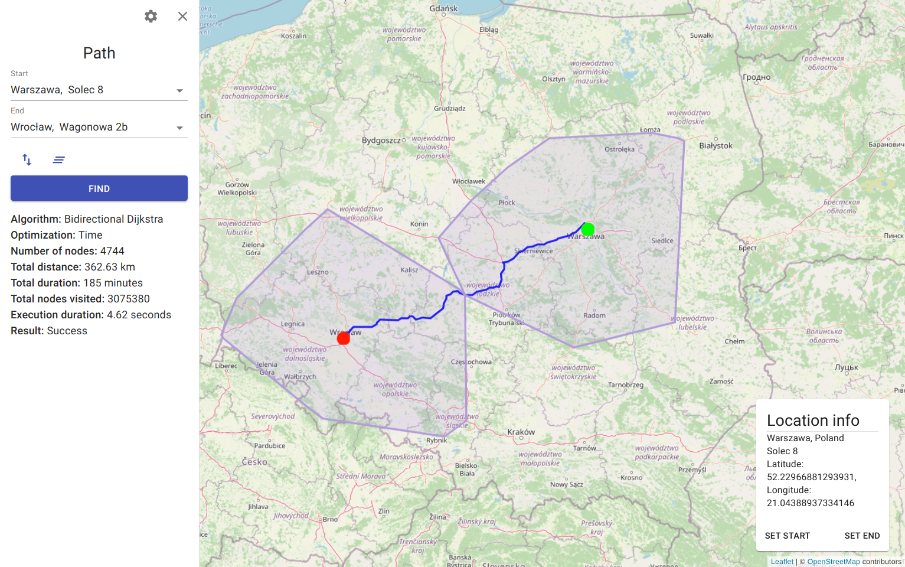
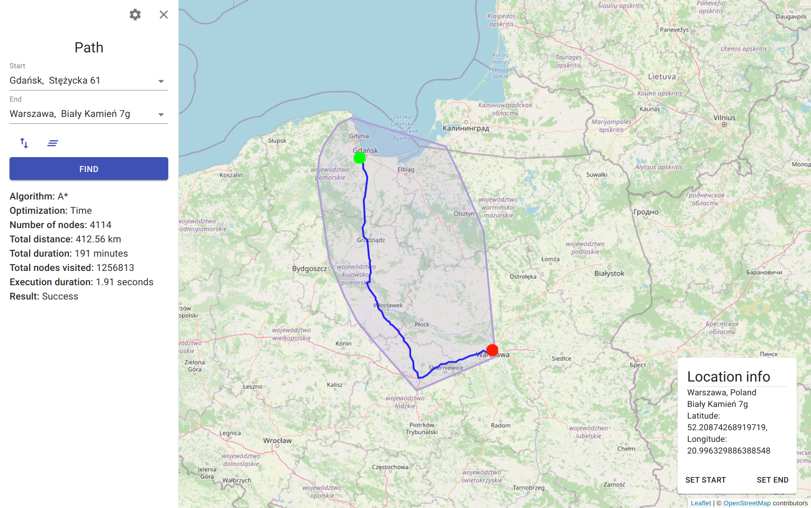
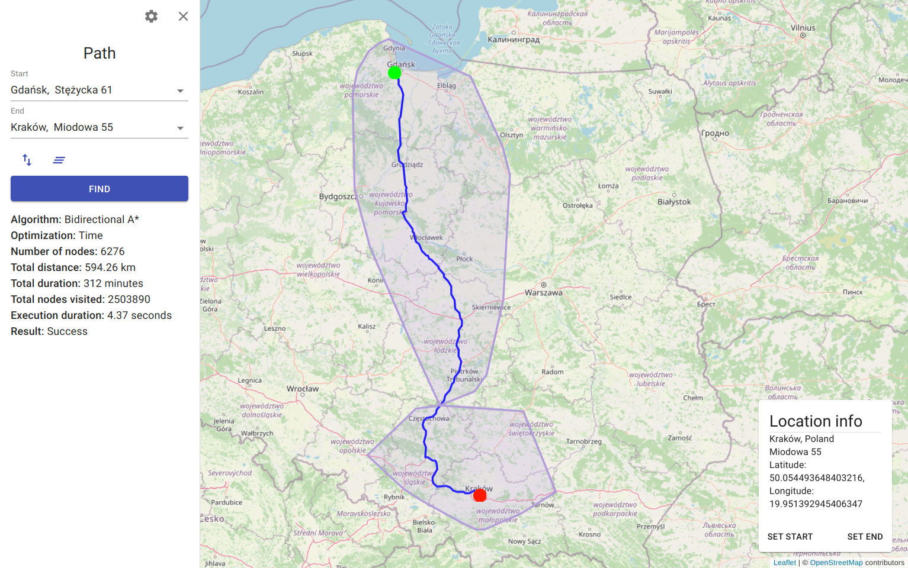

[](https://github.com/Nalhin/Navigation/actions/workflows/test.yml)
[](https://codecov.io/gh/Nalhin/Navigation)
[](LICENSE.md)

# Navigation

Real-world navigation based on open source spatial data and pathfinding algorithms.

## Table of contents

* [Description](#description)
* [Features](#features)
* [Presentation](#presentation)
* [Architecture](#architecture)
* [Technology Stack](#technology-stack)
* [Prerequisites](#prerequisites)
* [Setup](#setup)
* [License](#license)

## Description

The project provides the graphical interface to visualize and simulate the execution process of
various pathfinding algorithms. To ensure the most accurate and up-to-date results, it operates on
spatial data provided by the OpenStreetMap community. The use of microservice architecture enables
the entire application to be scalable, reliable and fault-tolerant.

## Features

* OSM file parser
* OSM street network graph
* Implementation and visualization of the following single-source shortest path (SSSP) algorithms:
    * [BFS](backend/libraries/pathfinder/src/main/java/com/navigation/pathfinder/pathfinding/BFSPathfinder.java)
    * [Bidirectional BFS](backend/libraries/pathfinder/src/main/java/com/navigation/pathfinder/pathfinding/BidirectionalBFSPathfinder.java)
    * [Bellman-Ford](backend/libraries/pathfinder/src/main/java/com/navigation/pathfinder/pathfinding/BellmanFordPathfinder.java)
    * [Dijkstra](backend/libraries/pathfinder/src/main/java/com/navigation/pathfinder/pathfinding/DijkstraPathfinder.java)
    * [Bidirectional Dijkstra](backend/libraries/pathfinder/src/main/java/com/navigation/pathfinder/pathfinding/BidirectionalDijkstraPathfinder.java)
    * [A*](backend/libraries/pathfinder/src/main/java/com/navigation/pathfinder/pathfinding/AStarPathfinder.java)
    * [Bidirectional A*](backend/libraries/pathfinder/src/main/java/com/navigation/pathfinder/pathfinding/BidirectionalAStarPathfinder.java)
* Implementation and visualization of the following pathfinding algorithms (their results might be
  suboptimal):
    * [DFS](backend/libraries/pathfinder/src/main/java/com/navigation/pathfinder/pathfinding/DFSPathfinder.java)
    * [Greedy Best First Search](backend/libraries/pathfinder/src/main/java/com/navigation/pathfinder/pathfinding/GreedyBestFirstSearchPathfinder.java)
    * [Bidirectional Greedy Best First Search](backend/libraries/pathfinder/src/main/java/com/navigation/pathfinder/pathfinding/BidirectionalGreedyBestFirstSearchPathfinder.java)
* Geocoding - converting addresses to coordinates
* Reverse Geocoding - converting coordinates to addresses
* Data distribution pipeline in a microservice architecture
* Interactive visualization on street and satellite maps

## Presentation

### Overview

<p align="center">
  <a href="https://www.youtube.com/watch?v=IceDA-gvo3M">
    
  </a>
</p>

### DFS

<p align="center">
  
</p>

### BFS

<p align="center">
  
</p>

### Bellman-Ford

<p align="center">
  
</p>

### Bidirectional BFS

<p align="center">
  
</p>

### Dijkstra

<p align="center">
  
</p>

### Bidirectional Dijkstra

<p align="center">
  
</p>

### A*

<p align="center">
  
</p>

### Bidirectional A*

<p align="center">
  
</p>

## Architecture

<p align="center">
    
</p>

### Services

In the process of designing the separation of responsibility, a strategic pattern proposed by Eric
Evans in the DDD methodology called Bounded Context was used. Contexts divide a complex domain into
smaller subdomains while encapsulating internal models and business logic. The application was
divided into the following contexts (represented as services)

* Geocoding - converts addresses to coordinates
* Reverse Geocoding - converts coordinates to addresses
* Pathfinding - generates summary statistics and data to visualize the execution of pathfinding
  algorithms
* OSM Data Processor - parses and loads the OSM data

The services are deployed as independent docker containers. Their API is provided to customers
through the Spring Cloud Gateway.

### Data Pipeline

By combining the Producer API and the Kafka Connect API, Kafka can propagate data across a
distributed system. Each service has a separate Kafka Connect API configuration, responsible for
adapting data to internal schemas and data persistence.

### Modules

The project consists of two main modules - services and libraries. Libraries offer universal
functionality decoupled from services and infrastructure. The pathfinder library provide
pathfinding, convex hull and edge weight calculation algorithms, and the implementation of graph
data structure. On the other hand, the parser library exports an API to load and extract data from
OSM files.

```
backend
  services 
    reverse-geocoding-service
    geocoding-service
    pathfinding-service
    osm-data-exporter-service
    gateway
    
  libraries 
    parser
    pathfinder
```

### Testing

One of the goals of separating domain components into separate libraries (based on interfaces) was
to simplify their testability. Using interfaces instead of classes allows designing particular
implementations for testing purposes (e.g. an in-memory version of an exporter)
, thus reducing the need to create mocks and stubs for specific test scenarios.

## Technology Stack

### Frontend

* Typescript
* React
* Leaflet
* React Query
* Material-UI
* React Testing Library
* Jest
* React Hook Form

### Backend

* Java
* Spring
* Hibernate
* Groovy
* Spock
* Testcontainers
* Gradle

### Infrastructure

* Docker
* Kafka
* Kafka Connect
* MongoDB
* Elasticsearch

### CI/CD

* Github Actions
* Codecov

## Prerequisites

Install [jdk16](https://www.oracle.com/java/technologies/javase-jdk16-downloads.html)
and [gradle](https://gradle.org/).

You should be able to run the following commands:

```bash
java --version
gradle --version
```

Install [docker](https://docs.docker.com/install/)
and [docker-compose](https://docs.docker.com/compose/).

You should be able to run the following commands:

```bash
docker --version
docker-compsoe --version
```

Install [node](https://nodejs.org/en), [npm](https://www.npmjs.com) and [yarn](https://yarnpkg.com).

You should be able to run the following commands:

```bash
node --version
npm --version
yarn --version
```

## Setup

### Download map data

#### Preconfigured download script

```bash
bash download.sh
```

#### Manual download

Visit [geofabrik website](http://download.geofabrik.de/europe) and download any .osm.bzip file.
Rename the downloaded file to ``osm-data.osm.bz2`` and move it to the `data` directory.

### Build the application

#### Backend

```
cd backend
./gradlew clean build 
```

#### Client

```
cd client
yarn install
yarn build
```

### Run docker compose

```bash
cd docker
docker-compose -f docker-compose.prod.yml up -d
sleep 30
bash init-prod.sh
```

### Wait for export

Wait for the export process to finish (osm-data-processor should shut itself down). This process
should take approximately 3-5 min per 100Mb of compressed map data.

### Open client

Open [localhost](http://localhost:3000) in your browser.

## License

This project is licensed under the MIT License - see the [LICENSE.md](LICENSE.md) file for details.
