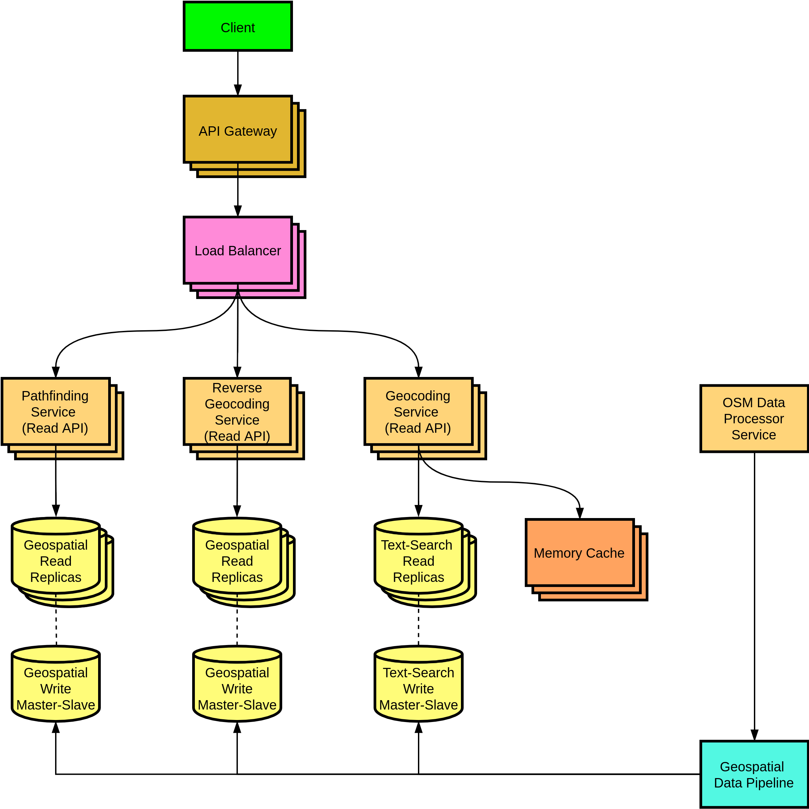

[](https://github.com/Nalhin/Navigation/actions/workflows/test.yml)
[](https://codecov.io/gh/Nalhin/Navigation)
[](LICENSE.md)

# Navigation

Navigation based on open source geospatial data and single-source shortest path algorithms.

## Table of contents
* [Description](#description)
* [Features](#features)
* [Presentation](#presentation)  
* [Architecture](#architecture)
* [Prerequisites](#prerequisites)
* [Setup](#setup)  
* [License](#license)

## Description

## Features

## Presentation

## Architecture

<p align="center">
    
</p>

### Modules

```
modules
  services 
    reverse-geocoding-api
    geocoding-api
    pathfinding-api
    osm-data-exporter
  libraries 
    parser
    pathfinder

```

## Prerequisites

## Setup

## License

This project is licensed under the MIT License - see the [LICENSE.md](LICENSE.md) file for details.